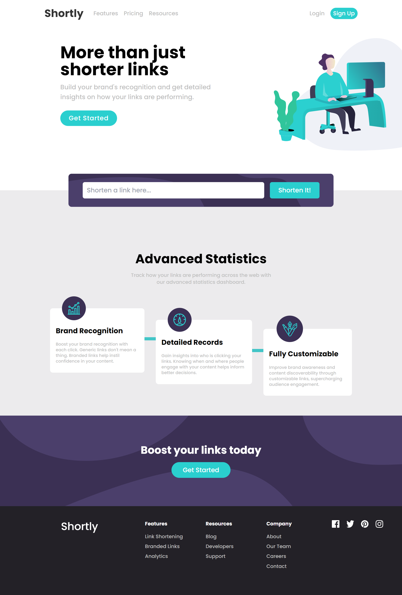

# Frontend Mentor - Shortly URL shortening API Challenge solution

This is a solution to the [Shortly URL shortening API Challenge challenge on Frontend Mentor](https://www.frontendmentor.io/challenges/url-shortening-api-landing-page-2ce3ob-G).

## Table of contents

- [Overview](#overview)
  - [The challenge](#the-challenge)
  - [Screenshot](#screenshot)
  - [Links](#links)
- [My process](#my-process)
  - [Built with](#built-with)
  - [What I learned](#what-i-learned)
  - [Useful resources](#useful-resources)
- [Author](#author)

## Overview

### The challenge

Users should be able to:

- View the optimal layout for the site depending on their device's screen size
- Shorten any valid URL
- See a list of their shortened links, even after refreshing the browser
- Copy the shortened link to their clipboard in a single click
- Receive an error message when the `form` is submitted if:
  - The `input` field is empty

### Screenshot



### Links

- Live Site URL: [Live](https://shortly-frontend.netlify.app/)
- Solution URL: [Solution](https://www.frontendmentor.io/solutions/shotly-made-with-ease-using-vite-react-jWiBlWFaKJ)

## My process

### Built with

- Semantic HTML5 markup
- TailwindCSS - For styling
- Flexbox
- Mobile-first workflow
- [React](https://reactjs.org/) - JS library
- [Vite](https://vitejs.dev/) - Frontend Tooling

### What I learned

- Custom react hook to handle visibility of current tab. This is quite useful if we want to render some change on the website when the user has lost focus of the current tab:
```
import { useState, useEffect, useCallback } from 'react'

function useIsTabVisible(setiscopy) {

    const handleVisibility = useCallback(() => {
        setiscopy(!document.hidden?'Copy':'Copied')
    }, [])

    useEffect(() => {
        document.addEventListener('visibilitychange', handleVisibility)

        return () => {
            document.removeEventListener('visibilitychange', handleVisibility)
        }
    }, [handleVisibility])

}

export default useIsTabVisible
```
- 
### Useful resources

- [TailwindCSS](https://tailwindcss.com/) - This helped me avoid writing a lot of unnecessary CSS and It has some unique features for responsive design and customization. Great help, will use it more from now on.
- [Vite](https://vitejs.dev/) - Best frontend tooling. Works wonders with react. Fast server setup and much more.

## Author

- Frontend Mentor - [@ManuKashyap01](https://www.frontendmentor.io/profile/ManuKashyap01)
- Github - [@ManuKashyap01](https://github.com/ManuKashyap01)
- Linkedin - [@manu-kashyap](https://www.linkedin.com/in/manu-kashyap/)
